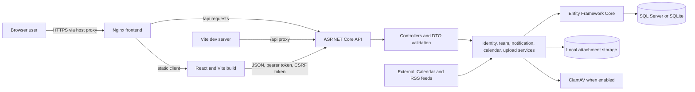
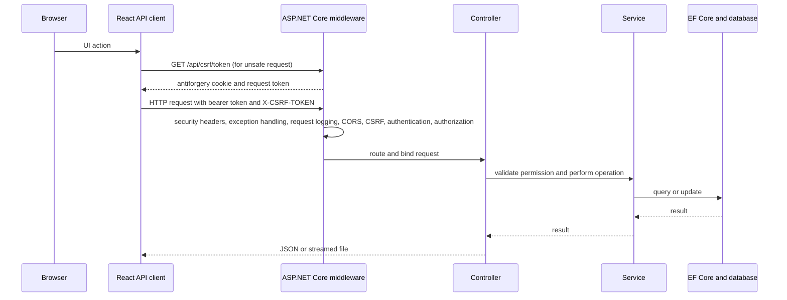
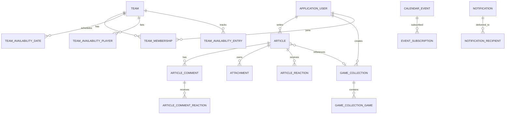

# Architecture and Features

ChessWeb is a single web application composed of a React client and an ASP.NET Core JSON API. In production, Nginx serves the built client and proxies `/api` to the backend. The backend uses Entity Framework Core with SQL Server in Compose and SQLite for a local Development run.

## System View

## Repository Map

| Path | Responsibility |
| --- | --- |
| `src/backend/Controllers` | HTTP routes and request authorization |
| `src/backend/DTOs` | API request and response records |
| `src/backend/Domain/Entities` and `Enums` | Persisted entities and domain values |
| `src/backend/Data` | EF Core context, startup schema initialization, and development data seeding |
| `src/backend/Services` | JWT, local file storage, calendar synchronization, teams, and notifications |
| `src/backend/Services/Uploads` | Content sanitization, malware scanning, rate-limit policy, and attachment rescanning |
| `src/backend/Validators` | Request and rich-content validation |
| `src/frontend/src/views` | Articles, board, calendar, players, profiles, team availability, notifications, settings, and admin views |
| `src/frontend/src/services` | HTTP client and frontend service adapters |
| `tests/backend` | xUnit and API integration tests |
| `src/frontend/src/test` and `src/frontend/src` | Vitest setup and frontend tests |

The current API has no Forums controller. `Competition` exists in the domain model, but there is no separate Competition controller or competition view in this checkout. Team and team-availability workflows are implemented independently.

## Request and Security Flow

The frontend stores the JWT in `localStorage` under `chessweb_token` and attaches it as a bearer token. The API client obtains an antiforgery request token and sends it in `X-CSRF-TOKEN` for POST, PUT, PATCH, and DELETE requests; a cookie accompanies those requests. The backend configures the antiforgery cookie as `Secure` and `SameSite=None` outside Development. Public deployments therefore require HTTPS.

Authorization is implemented at both controller and action level. Many writes also check resource ownership or team membership in action logic; a signed-in user is not automatically allowed to modify another user's content. The defined role names are `RegisteredUser`, `ClubMember`, `Admin`, and `SuperAdmin`. Admin-only operations include team administration, partner management, calendar-feed management, and user role administration. Runtime logging settings are SuperAdmin-only. Consult the [API reference](api.md) for route-specific access notes.

Identity requires passwords to be at least 8 characters; the current configuration does not require particular digit, case, or punctuation classes. Login and registration are rate-limited by the request IP observed by the API, with default limits of 5 and 3 requests per minute respectively. Development appsettings raises both limits for local testing. JWT signing keys must contain at least 32 UTF-8 bytes. Token lifetime is configured through `Jwt:DurationInMinutes`, restricted to 60-120 minutes, and defaults to 60 minutes.

## Main Domain Areas

The primary persisted areas are:

- **Articles and analysis:** article content can be plain text or validated rich-content JSON. Articles can include PGN/FEN data, reactions, paginated comments, and uploaded attachments. A game collection can be linked to an article without being deleted when the article is removed.
- **Game collections:** an authenticated owner manages an ordered list of PGN games and can export a collection. Editing in the frontend's analysis tools does not silently write back to a loaded collection.
- **Calendar:** events can be recurring and grouped into a series. Admin-managed iCalendar/RSS feeds synchronize event data. Users can subscribe to individual events or a series and export `.ics` data.
- **Teams:** team memberships, captains, season dates, match dates, roster players, availability entries, and season reports support club team coordination. Team-level access is checked in the API.
- **Notifications:** notifications are stored with recipient rows so each recipient has independent read state.
- **Partners and logging:** partner records and logos are managed separately from articles. A persisted logging setting controls the Serilog minimum level and retention.

## Upload Handling

Uploads are stored by `LocalFileStorageService`; `FileStorage:Provider` accepts only `Local`. The default local path is `App_Data/Uploads`; Compose mounts a persistent volume at `/var/lib/chessweb/uploads`. Downloads are streamed through API actions rather than exposed as a public static directory.

The backend accepts JPG/JPEG, PNG, GIF, WebP, PDF, PGN, and TXT files up to 5 MiB. Images are decoded and re-encoded, checked against the claimed extension, limited to 25 megapixels, and downscaled to a maximum 2048-pixel dimension. GIF input is stored as a static PNG. PDFs are signature-checked; text files must be valid UTF-8. Content types are assigned by the server. The upload request is also rate-limited by authenticated user or client address, with a default of 20 per minute.

When `ClamAv:Enabled` is true, new uploads are scanned before storage. The production Compose stack enables ClamAV. Uploads fail closed while the scanner is unavailable; the attachment rescan service periodically checks stored article attachments and quarantines detections. Development appsettings disables scanning. Treat that configuration as local-only.

## Validation and Limits

Backend validators enforce request limits regardless of frontend checks. Current notable limits include article title 200 characters, summary 1,000, plain content 30,000, rich JSON content 50,000, PGN 15,000, FEN 150, and comment content 5,000 characters. Rich content is parsed against an allowlist, with limits on nesting depth and node count. See `src/backend/Validators` and `src/backend/Services/Uploads` for the authoritative rules.

## Data Initialization and Logs

At startup, `DbInitializer` calls EF Core `EnsureCreated` and applies provider-specific compatibility schema changes before seeding baseline records. Demo accounts and sample content are only enabled when `SeedDemoData=true`; startup throws if that flag is enabled outside Development. `ResetDemoAdminPassword` resets the seeded account passwords when enabled. This is not a production migration workflow: back up data before application upgrades and review initializer changes.

Serilog writes to console and rolling files under `App_Data/Logs`. Retention is controlled by `Logging:RetainedFileCountLimit`; minimum level can also be updated at runtime by a SuperAdmin and is loaded from the database on restart.

## Related Guides

- [HTTP API reference](api.md)
- [Development and tests](development.md)
- [Deployment and operations](deployment.md)
