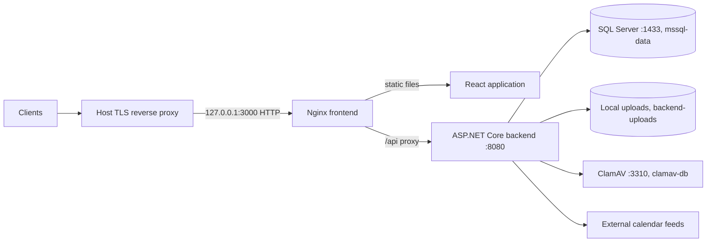

# Deployment and Operations

## Production Compose

The root `docker-compose.yml` builds the frontend and backend images and runs four services: Nginx frontend, ASP.NET Core backend, SQL Server 2019, and ClamAV. Set the two required secrets before starting. PowerShell example:

```powershell
$env:MSSQL_SA_PASSWORD = "<strong SQL Server SA password>"
$env:JWT_SIGNING_KEY = "<long random JWT signing key>"
docker compose up --build -d
```

Bash example:

```bash
export MSSQL_SA_PASSWORD='<strong SQL Server SA password>'
export JWT_SIGNING_KEY='<long random JWT signing key>'
docker compose up --build -d
```

Compose fails if either variable is unset. Supply real secrets through the deployment environment or a protected secret manager; do not check them into source control. The example Compose configuration is a starting point, not a complete managed production platform.



The frontend publishes only `127.0.0.1:3000:80`; SQL Server, ClamAV, and the backend are not published to the host in production Compose. Nginx proxies `/api/` to `backend:8080`. Place a host reverse proxy in front of the loopback frontend port, terminate TLS there, preserve the `/api` path, and set `X-Forwarded-Proto` to `https`. The edge proxy must replace any client-supplied `X-Forwarded-For` with the validated client address; the bundled Nginx appends its peer address. The API trusts only the bundled frontend (`172.30.240.2`) and Compose bridge gateway (`172.30.240.1`) when calculating client IPs for rate limits. Keep the backend private and update the explicit proxy list and network if the topology changes. Set HSTS at the TLS-terminating proxy, not on the plain-HTTP frontend container. Production antiforgery cookies are Secure and require HTTPS for remote users.

## Development Compose

```powershell
docker compose -f docker-compose.dev.yml up --build
```

This profile is for trusted development only. It enables `ASPNETCORE_ENVIRONMENT=Development`, SQL Server, sample seeding, demo-password resets, and ClamAV. It has development-only fallback values for `MSSQL_SA_PASSWORD` and `JWT_SIGNING_KEY`; override them on shared development machines. The backend and SQL Server ports bind to `127.0.0.1`; do not change them to all interfaces unless the machine and credentials are managed for that exposure. The frontend defaults to host port 3001 and supports `FRONTEND_PORT`.

## Persistent Data and Backups

| Volume | Container path | Contents |
| --- | --- | --- |
| `mssql-data` | `/var/opt/mssql` | SQL Server database files |
| `backend-uploads` | `/var/lib/chessweb/uploads` | User-uploaded files |
| `clamav-db` | `/var/lib/clamav` | ClamAV signatures |

`docker compose down` stops/removes containers but keeps named volumes. `docker compose down -v` removes the volumes and permanently deletes database, upload, and scanner data. Back up the database and uploads independently, test restores, and coordinate backups so database attachment records and stored files remain consistent.

Only local file storage is implemented. `FileStorage:Provider` must be `Local`; files are streamed through API endpoints and are not served directly from the upload volume. Existing objects from an older external storage provider are not migrated automatically. Plan and verify any data migration before cutover.

## Scanner and Upload Operations

Production Compose enables ClamAV and persists its signature database. On first start, ClamAV may need several minutes to download signatures and roughly 1.5-3 GB of memory. The backend waits for the scanner container to start, not for signatures to finish loading. During that window, uploads fail closed with `503` rather than being stored unscanned. The backend also runs a periodic rescan service when scanning is enabled; detected article attachments are quarantined and no longer served. Partner logos are not part of this attachment rescan flow.

The SQL Server service has a health check and the backend waits for it to become healthy. ClamAV has no equivalent readiness health check in this Compose file. The backend has no configured Compose health check, so container running state alone does not prove the API is ready. Monitor application logs and service-specific signals in your deployment environment.

## Configuration and Security Checklist

- Use unique, strong `MSSQL_SA_PASSWORD` and `JWT_SIGNING_KEY` secrets and protect them from logs and source control.
- Keep the JWT key at least 32 UTF-8 bytes; the configured lifetime must be 60-120 minutes (60 minutes by default). The backend enforces a 15-character minimum password length without composition rules.
- Keep the default per-IP login and registration limits (5 and 3 requests/minute) appropriate for the deployment. Forwarded headers are processed only from the explicit trusted-proxy addresses configured in Compose; do not trust arbitrary forwarded headers or publish the backend directly.
- Terminate TLS at a trusted reverse proxy before allowing remote access. The Compose frontend itself serves plain HTTP on a loopback-only host binding.
- Configure `Cors:AllowedOrigins` for the exact browser origins you serve. Keep credentialed cross-origin access restricted.
- Keep ClamAV enabled for deployed environments and monitor scanner availability, signature updates, and upload `503` responses.
- Persist and back up both `mssql-data` and `backend-uploads`; verify restore procedures.
- Keep seeded demo accounts, `SeedDemoData`, `ResetDemoAdminPassword`, and development fallback secrets disabled in production.
- Review security headers in `src/frontend/security-headers.conf` and `src/backend/Middleware/SecurityHeadersMiddleware.cs` when changing frontend assets, external origins, or worker behavior.
- Restrict access to runtime logs and retain enough history for operations without filling the container filesystem.

The API uses JWT bearer authentication plus antiforgery tokens for unsafe methods. Production antiforgery cookies use `Secure` and `SameSite=None`; public deployment without HTTPS will break those flows. The frontend CSP permits only configured same-origin resources and the WebAssembly worker needed by Stockfish; adding external resources may require a reviewed CSP change.

## Startup, Schema, and Shutdown

The backend initializes the database at startup with EF Core `EnsureCreated` and provider-specific compatibility SQL. There is no separate EF migration command in the current startup workflow. Review `DbInitializer` changes carefully, back up before upgrades, and test application versions against a restored database before rollout.

Inspect container output with `docker compose logs -f backend frontend db clamav`; the backend also writes rolling files under `App_Data/Logs` inside its container. Arrange external collection/retention if logs must survive container replacement. For routine shutdown use `docker compose down`; avoid `-v` except when intentionally deleting all persistent data.

For local workflow details, see [development.md](development.md). For endpoint authorization and request requirements, see [api.md](api.md).